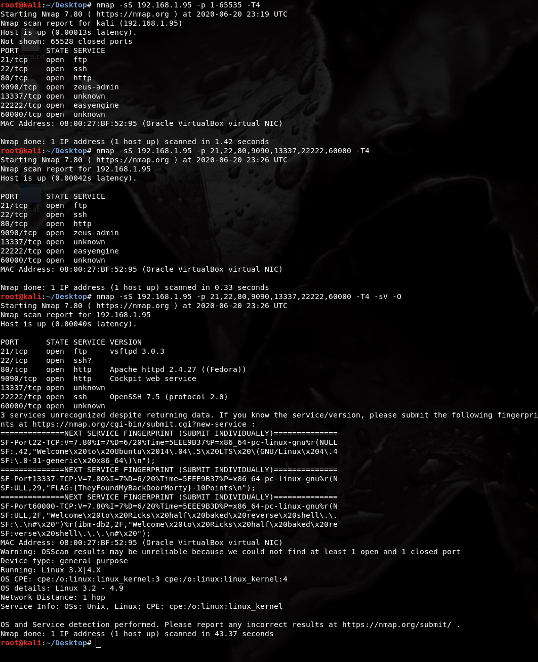

# RickdiculouslyEasy: Walkthrough 

```
More detailed descriptions to be added soon 
```



```
nmap scans to reveal open ports 
```


```
ftp(21) port is open so a quick look shows the first flag file (flag 1)
```


```
A nikto scan shows some pretty normal directories (Passwords ;D)
```


```
The directory /password reveals flag 2
```


```
A look inspection into the password page shows commented password "winter"
```


```
ssh port(22) was shown to be opened on using the nmap scans. Using the password found and guessing the usernnames 
it was possible to login.  
```
```
found flag 3 and safe_password.jpg 
using the password found in metadata.
```


```
flag 4
```


```
flag 5
```


```
not flag
```

